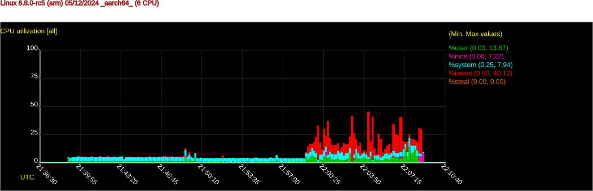

Python graphing artifacts for sysstat data (sar binary format)
==============================================================

Basically a test-bed to see what works for simple time-series of perf
data collected from a modest embedded board running Linux and several
multi-threaded applications.

* candidate 0 - https://github.com/sysstat/sysstat / contrib/sargraph/sargraph2 (stale headers)
* candidate 1 - https://github.com/stoneboy100200/sclean (expects text output from **stat cmds)
* candidate 2 - https://github.com/pdutton-vc/sarviewer (not really python, broken)
* candidate 3 - https://github.com/jpgxs/python-sadf (example old and broken)
* candidate 4 - https://github.com/pafernanr/sarcharts (works fine except on older embedded kernels)
* candidate 5 - https://github.com/sakti/gperf (old and needs cleanup, graphs ugly)

Run the following Tox_ command to sync the the above candidate repositories
and create a "dev" environment for testing::

  $ tox -e sync
  $ tox -e dev
  $ source .venv/bin/activate

.. _Tox: https://tox.wiki/en/latest/user_guide.html

Summary
=======

* candidate 4 works out-of-the-box, but only if ``CONFIG_EMBEDDED`` is
  *not* enabled in the host kernel
* the browser-based result looks nice and handles fairly dense data well

The rest have everything from bit-rot to stale (out-of-order) headers and most
haven't been touched in at least 4-5 yrs.

Other than sarcharts_ the only viable/alternate workflow appears to be:

1. generate SVG graphs directly from binary data file(s) using ``sadf`` --or--

1. extract CSV data from the main binary data file(s) using ``sadf``
2. ingest CSV data via spreadsheet or custom script (Python, shell, etc)

.. _sarcharts: https://github.com/pafernanr/sarcharts

Notes
-----

* CSV can be extracted with the usual argument options, so you get to
  choose all or just a subset/single data type (eg, CPU data)
* CSV data is separated by type with a comment line showing the headers
  for each type, otherwise *there are no column headers*
* the CSV separators are semicolons (not commas)

Examples
========

You can run the subtools as shown in the cron entry, or you can run one of
the main parent commands (eg, ``sar``) but note the argument order is not
the same.

Example from man page::

  $ /usr/lib/sa/sa1 1 1  # data type is ALL non-optional data; args are interval, count

Examples using ``sar``::

  $ sar -A 1 1  # collect ALL plus -I and -P (see man page)
  $ sar -r ALL -u ALL 1 1  # collect only CPU and MEM parameters

Extract all data as CSV::

  $ sadf -d -- -A /path/to/sa/sa05 > all.csv

Extract only CPU data as CSV::

  $ sadf -d -- -u ALL /path/to/sa/sa10 > sa10-cpu.csv

Generate full HTML charts for all data::

  $ sarcharts data/sa10

Graphs
------

.. figure:: examples/sarcharts.png
  :width: 90%

  Figure 1 sarcharts memused (percent)

  Figure 2 sadf CPU parameters (cropped and converted to png)

  Figure 3 gperf CPU (percent)

Sample data
-----------

Sample data from arm64 test devices illustrating the result of Linux kernel
option ``CONFIG_EMBEDDED`` on (sar) activities. Enabled on Rpi kernel, but no
longer exists in 6.8.

Rockchip with 6.8.x kernel, filename prefix ``sa11``::

  Linux nanopi-r5c 6.8.6-gentoo-dist #1 SMP PREEMPT_DYNAMIC Sat Apr 13 14:35:01 -00 2024 aarch64 GNU/Linux

Broadcom rpi64 with 5.15.x rpi-sources kernel, filename prefix ``sa09``::

  Linux raspberrypi3-64 5.15.92-v8 #1 SMP PREEMPT Wed Feb 8 16:47:50 UTC 2023 aarch64 aarch64 aarch64 GNU/Linux
