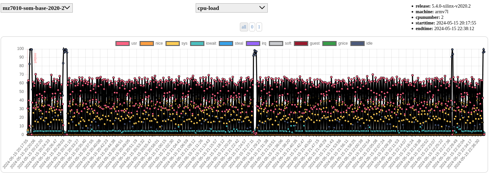

Python graphing artifacts for sysstat data (sar binary format)
==============================================================

Basically a test-bed to see what works for simple time-series of perf
data collected from a modest embedded board running Linux and several
multi-threaded applications.

* candidate 1 - https://github.com/stoneboy100200/sclean
* candidate 2 - https://github.com/pdutton-vc/sarviewer (not really python)
* candidate 3 - https://github.com/jpgxs/python-sadf (archived 2 yrs ago)
* candidate 4 - https://github.com/pafernanr/sarcharts
* candidate 5 - https://github.com/sakti/gperf.git (old and needs cleanup)

Run the following Tox_ command to sync the the above candidate repositories
and create a "dev" environment for testing::

  $ tox -e sync
  $ tox -e dev
  $ source .venv/bin/activate

.. _Tox: https://tox.wiki/en/latest/user_guide.html

Examples
========

  Figure 1 sarcharts memused (percent)

.. figure:: examples/gperf_cpu.png
  :width: 90%

  Figure 2 gperf CPU (percent)
